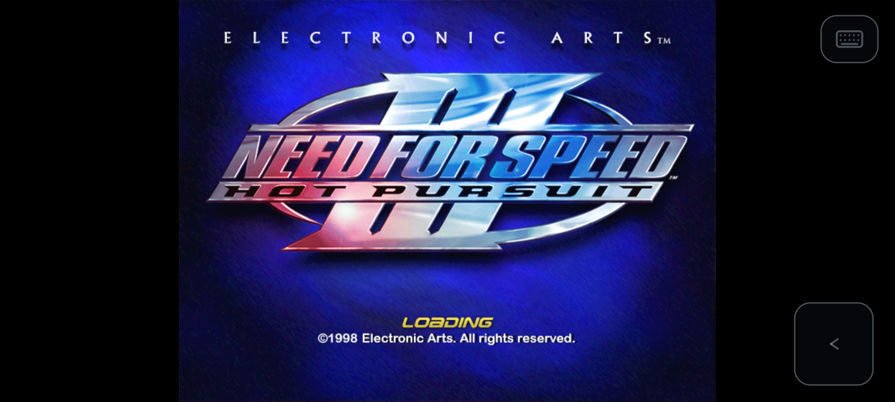
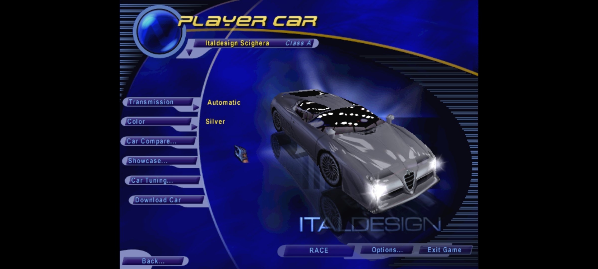
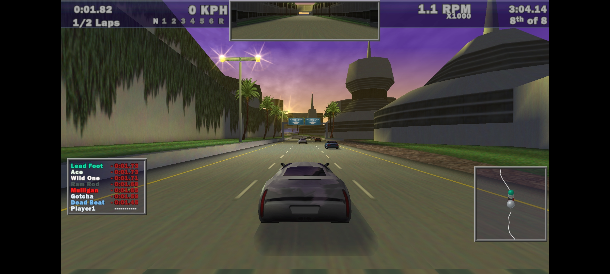
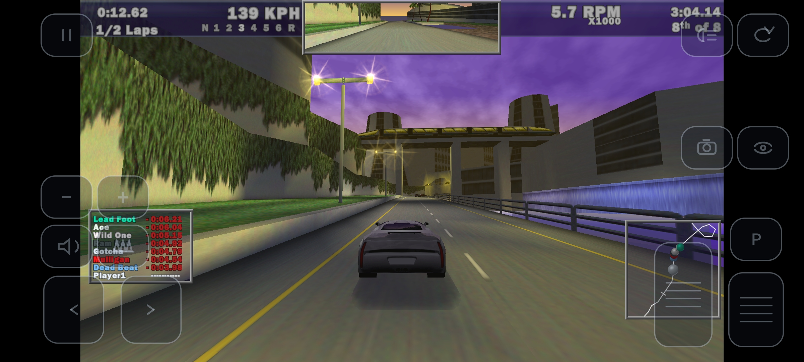
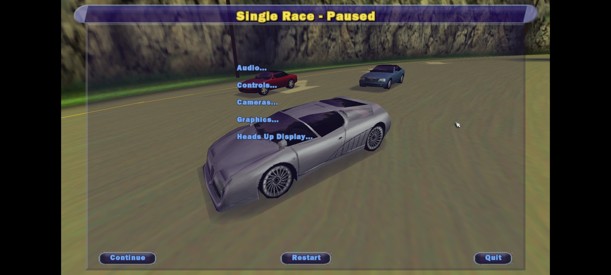
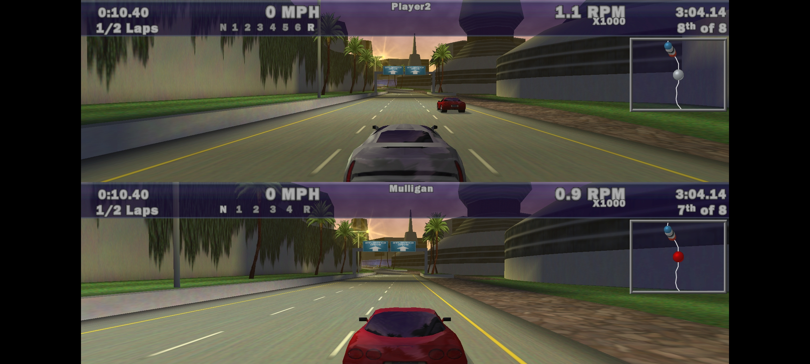
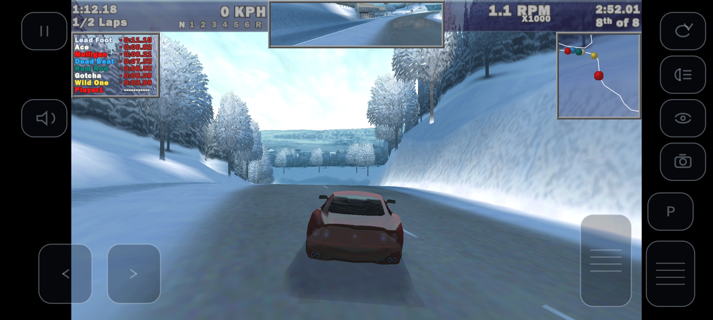

# NFS III: Hot Pursuit — Android

Need for Speed III: Hot Pursuit, the 1998 PC game, running natively on Android
phones.

It is not an emulator. The original Windows executable is recompiled into
portable C++ — a static recompilation, built on
[motor-dev/nfs-recompiled](https://github.com/motor-dev/nfs-recompiled) — and
the Windows, DirectX and Glide calls it makes are reimplemented on SDL3 and
OpenGL ES. This fork makes it a phone game: a launcher, touch controls, two
gamepads with split screen, vibration, widescreen races up to 1920x1080 and
full-colour textures.

## Playing

You need:

- a device with Android 8.0 or newer, a 64-bit ARM processor (ARMv8,
  arm64-v8a) and OpenGL ES 3.0 graphics;
- the game's data from your own copy: the `FEDATA` and `GAMEDATA` folders of
  the 1998 retail disc.

1. Copy both folders to the phone, for example to `/sdcard/nfs3-og`.
2. Install the app, open it and import that folder.
3. Play.

How it works, building it, and every setting: [TECHNICAL.md](TECHNICAL.md).

Need for Speed III: Hot Pursuit is the property of Electronic Arts. This
repository contains no game content.
