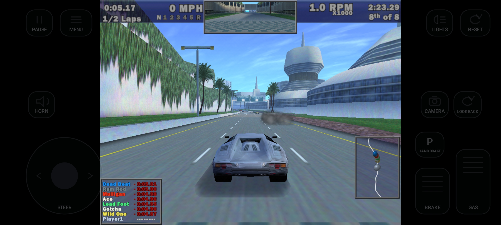
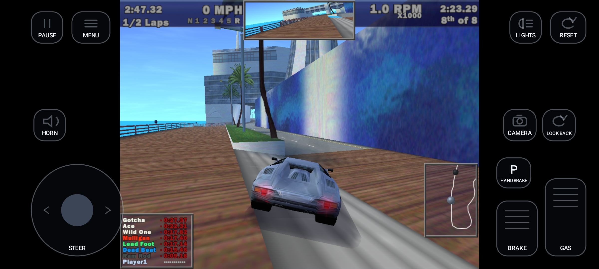
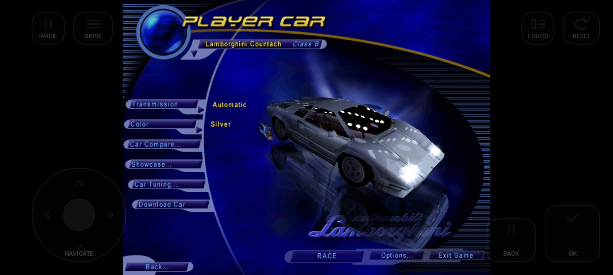
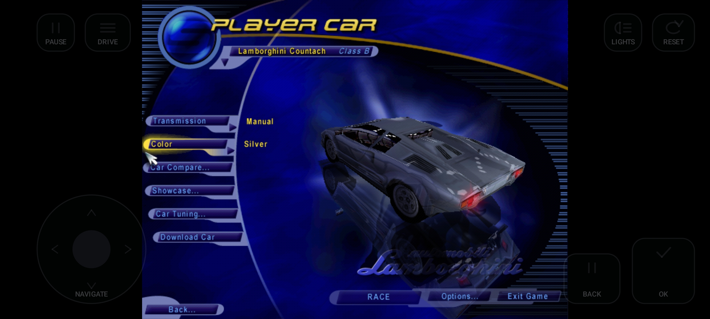

# NFS III: Hot Pursuit — Android

An Android port of the static recompilation of **Need for Speed III: Hot Pursuit**.
The original 1998 Win32 x86 executable is translated into portable C++ that runs
on a virtual x86 CPU, with the Win32, DirectDraw, DirectInput, DirectSound and
Glide 2x calls it makes reimplemented on top of SDL3 and OpenGL ES.

Based on [motor-dev/nfs-recompiled](https://github.com/motor-dev/nfs-recompiled),
which does the recompilation itself and targets desktop. This fork adds the
Android target: a launcher, touch controls, gamepad handling, and a number of
fixes in the Glide layer that only showed up once the game ran on a phone.






## What you need to supply

The original executables are in the repository, as in the upstream project, so a
clone builds and runs as-is. What is **not** here is the game content: you need
`FEDATA` and `GAMEDATA` from a retail disc of the 1998 release. The Europe
"Sold Out Software" disc is known to match; a CD image works.

Copy those two folders somewhere and clear the read-only attribute afterwards,
or the game cannot write its settings and saves. That folder is what you import
in the launcher.

Use data from the **same 1998 release**.

`install.win` is the table of data paths the game reads before anything else,
and the installer -- not the disc -- produces it. A working copy is in this
repository at `android/app/src/main/assets/gamefiles/install.win`; the Android
build packages it automatically, and for a desktop run copy it next to the game
data. `tools/make_install_win.py` regenerates it and documents the format, which
was reverse-engineered from the executable.

So a complete desktop game folder is: `fedata/`, `gamedata/`, `install.win`, and
the four executables from `nfs3hp/`.

## Building

### Android

Requires Android SDK with **NDK 28.2.13676358**, build-tools 36.0.0, compileSdk
36, and a JDK (Android Studio's bundled JBR works). The app is arm64-v8a only,
minSdk 29, so it installs on Android 10 and later.

SDL3 is built from source on Android and is not vendored here — clone it first:

```bash
git clone --depth 1 --branch release-3.4.2 https://github.com/libsdl-org/SDL third_party/SDL
```

Then build:

```bash
cd android
./gradlew assembleDebug
```

`android/build.bat` does the same on Windows but hardcodes the JDK and SDK
paths of the machine it was written on — edit them or use `gradlew` directly.

The APK lands in `android/app/build/outputs/apk/debug/`. For a release build use
`assembleRelease`; it is unsigned, so align and sign it yourself with
`zipalign` and `apksigner`.

### Desktop (Windows)

Uses the prebuilt SDL3 in `sdl3/`. CMake ≥ 3.15 and a C++17 compiler:

```bash
cmake -B build -DCMAKE_BUILD_TYPE=Release
cmake --build build
```

Run it with the path to your game folder:

```bash
./build/nfs3hp /path/to/game
```

With two arguments the second is the CD path, for a setup where the data is
split between an install directory and the disc.

### CMake options

| Option | Default | Description |
|---|---|---|
| `WITH_MMX` | `ON` | MMX bit in the emulated CPUID. Leave it on: with MMX reported absent the game picks a different set of copy/decode routines and the movie streamer breaks. |
| `WITH_PEDANTIC_FPU` | `OFF` | Strict 80-bit x87 emulation through NASM helpers. Linux only. |
| `NFS_TRACE_MSG` | `OFF` | Message-pump and Glide state tracing. Very verbose, desktop diagnostics only. |
| `NFS2_ASSERT_TRAP` | `OFF` | Turn the unsupported-path assert into a debugger break instead of a log line. |
| `NFS_BUILD_FF_TESTS` | `OFF` | Build `force_feedback_checks`, a desktop regression test for the DirectInput force-feedback layer. Runs against an SDL virtual joystick; desktop only. |

## Running on a phone

1. Put the game data folder somewhere on the device, e.g. `/sdcard/nfs3-og`.
2. Launch the app, import that folder, make it the active data set.
3. Play.

The launcher also has a controls hub (Controls → Touch / Gamepad) with
button mapping, a touch layout editor, and screen settings.

### Vibration

The game's own DirectInput force-feedback effects are implemented
(`src/lib/winapi/dinput/idirectinputeffect.cpp`) and translated to rumble:
constant, ramp, the periodic waveforms and spring, with envelopes and gain.
Turn it on per output in Controls — phone vibration under Touch, controller
vibration under Gamepad — each with its own intensity, and enable force
feedback in the game itself. Restart the game after changing it. Nothing
vibrates on a button press; every effect comes from the game. The last input
you used picks which output receives it.

### Environment variables

Read once at startup, set from `NFS3Activity.onCreate()` on Android:

| Variable | Default | Description |
|---|---|---|
| `NFS_FPS_CAP` | `30` | Frame rate the renderer paces presents to. The game's logic is tuned for 30 Hz. |
| `NFS_ORIENTATION` | unset | `auto` allows portrait; anything else pins landscape. Must be set before `SDL_Init`. |
| `NFS_GAMEPAD_MAPPING` | unset | `button=key` pairs overriding the menu keyboard mapping, e.g. `south=return,west=space`. |
| `NFS_TRACE_API` | unset | Log every intercepted Win32/DirectX call. Pair with `SDL_LOGGING=app=verbose` and filter logcat to `SDL/APP`. |
| `NFS_SCREENSHOT` | unset | Path to write a `.bmp` of the framebuffer to, every `NFS_SCREENSHOT_MS` (default 2000). |
| `NFS_TOUCH_VIBRATION` | `0` | `1` exposes a force-feedback output endpoint with touch-only input, so the game's effects reach the phone's vibrator. |
| `NFS_GAMEPAD_VIBRATION` | `0` | `1` lets the game's effects drive an attached controller's rumble. |
| `NFS_TOUCH_STEER_LEFT` etc. | unset | The keys the touch overlay sends for steering and the pedals, so that endpoint can report them as axes. Set from the touch mapping. |

## Regenerating the recompilation

The repository ships the generated C++, so this is only needed if you change the
disassembler in `disasm/`:

```bash
pip3 install capstone
python3 disassemble_nfs3hp.py
```

It reads `nfs3hp/nfs3.exe` and the three DLLs and rewrites
`src/nfs3hp/disassembly`.

## Known issues

- **Mosaic artefacts in the headlight-lit area on Mali GPUs.** Blocky patches
  appear where the projected headlight texture falls on the road, only while
  moving. Not reproducible on Adreno with the same build, with or without
  mipmapping, so it looks like a driver difference rather than a bug in the
  Glide layer. Unresolved.

## How it works

1. **Python disassembler** (`disasm/`) — Capstone-based, turns the original
   `.exe` and `.dll` into C++ that reproduces the program as operations on a
   virtual CPU.
2. **Virtual x86 CPU** (`include/cpu.h`, `include/fpu.h`, `include/mmx.h`) —
   registers, flags, a full x87 FPU with optional 80-bit precision, MMX.
3. **Win32 layer** (`src/lib/winapi/`) — native reimplementations of the API
   modules the game uses, including Glide 2x.
4. **SDL3 + OpenGL backend** (`src/lib/sdl-backend/`, `src/lib/gliderenderer.cpp`)
   — windowing, audio, input, files, timers, and the translation of 3Dfx draw
   calls into OpenGL ES.

## Credits

- [motor-dev/nfs-recompiled](https://github.com/motor-dev/nfs-recompiled) — the
  recompilation this is built on.
- [libsdl-org/SDL](https://github.com/libsdl-org/SDL) — SDL3, zlib licence.
- [sse2neon](https://github.com/DLTcollab/sse2neon) — SSE2 intrinsics on ARM,
  MIT licence, vendored as `third_party/sse2neon.h`.

Need for Speed III: Hot Pursuit is the property of Electronic Arts. This
repository contains no game content -- no tracks, cars, audio or video. Those you bring from your own disc.
